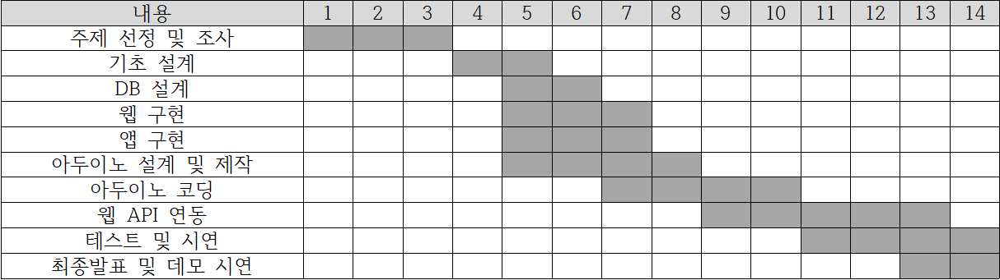

# pillMe
## 소개

## 개발 배경
현대인들의 불균형한 식습관으로 인한 영양 결핍은 빈혈, 허약, 피로 등과 같은 형태의 부작용이 따른다. 이러한 결핍된 영양소를 보충하기 위해 건강기능식품과 건강보조식품에 대한 관심이 많아졌다. 바쁜 현대인의 특성상, 영양제를 언제 복용해야하는지, 영양제의 잔량이 얼마나 남았는지 자주 깜박하는 경우가 많다. 그래서 아두이노를 활용한 약뚜껑 모듈을 개발하고, 서버를 연동하여 스마트폰 앱과 웹사이트를 통해 약 복용 알림을 제공받고, 가족이나 친구의 영양제 복용 여부를 쉽게 확인할 수 있다. 또한 영양제 검색 기능을 통하여 영양제의 효능과 부작용 등을 편하게 확인할 수 있는 기회를 제공한다.

## 팀 구성 및 역할 분담
* 이승헌(팀장)

    APP 개발(Swift) 및 API 서버
* 김동후

    DB 구축
* 김민기

    아두이노 설계 및 코딩
* 차재호

    DB 구축 및 웹 서버 구성

## 개발 일정

## 기술 스택(Server 및 DB)
* Server

    
    

* Database

    

* Web

       
       
       

* etc

       

## 계획서 및 회의록

* 계획서 및 회의록

    [download](https://drive.google.com/file/d/1QIVHU1cSp41ZD4vila9xkp55LLVTUB4l/view?usp=share_link)